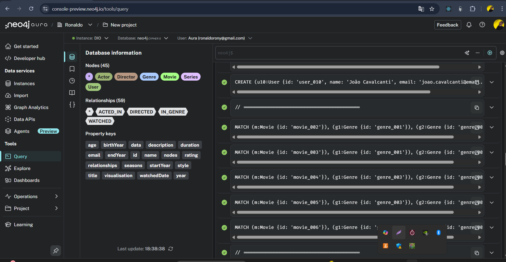

# Modelagem de Dados em Grafos - Serviço de Streaming



## 📋 Descrição do Projeto

Este projeto implementa uma modelagem de banco de dados em grafo usando **Neo4j** para um serviço de streaming de filmes e séries. O foco está nos relacionamentos entre entidades para criar um sistema de recomendação poderoso.

## 🎯 Objetivos

- Modelar um grafo de conhecimento para serviços de streaming
- Demonstrar relacionamentos complexos entre usuários, conteúdo e pessoas
- Preparar dados para sistemas de recomendação

## 📊 Modelo de Dados

### Entidades (Nós)

| Entidade | Descrição | Propriedades Principais |
|----------|-----------|------------------------|
| **User** | Usuários do serviço de streaming | id, name, email, age |
| **Movie** | Filmes disponíveis | id, title, year, duration, rating |
| **Series** | Séries disponíveis | id, title, startYear, endYear, seasons, rating |
| **Genre** | Gêneros de conteúdo | id, name |
| **Actor** | Atores | id, name, birthYear |
| **Director** | Diretores | id, name, birthYear |

### Relacionamentos (Edges)

| Relacionamento | Descrição | Propriedades |
|----------------|-----------|--------------|
| **WATCHED** | Usuário assistiu filme/série | rating (1-5), watchedDate |
| **ACTED_IN** | Ator participou de filme/série | - |
| **DIRECTED** | Diretor dirigiu filme/série | - |
| **IN_GENRE** | Conteúdo pertence a gênero | - |

### Estrutura Visual do Grafo

```
User ──[WATCHED]──> Movie ──[IN_GENRE]──> Genre
                  Series ──[IN_GENRE]──┘
                    ↑                      ↓
                    └──[ACTED_IN]─────────┘
                    └──[DIRECTED]─────────┘
                  Actor               Director
```

## 📁 Arquivos do Projeto

- **`modelo-grafo.arrows`** - Arquivo de diagrama para o Arrows.app
- **`script.cypher`** - Script completo para criação e população do banco
- **`consultas-exemplo.cypher`** - Consultas Cypher de exemplo para análise
- **`DIAGRAMA.md`** - Diagrama ASCII da estrutura do grafo
- **`README.md`** - Este arquivo
- **`imagens/`** - Pasta com screenshots e diagramas do projeto

## 🚀 Como Usar

### Pré-requisitos

- Neo4j Desktop, Neo4j Community Edition ou Neo4j Aura instalado
- Browser do Neo4j, Neo4j Bloom ou Neo4j Aura Console para visualização
- Acesso a internet para usar o Arrows.app (opcional)

### Instalação

1. Abra o Neo4j Browser, Neo4j Aura Console ou conecte-se à sua instância Neo4j
2. Certifique-se de que o banco de dados está vazio ou crie um novo banco
3. Execute o arquivo `script.cypher` completo (copie e cole todo o conteúdo)
4. Aguarde a execução e confirme que todos os nós e relacionamentos foram criados

### Visualizar o Diagrama

1. Acesse [arrows.app](https://arrows.app)
2. Clique em "Import" e carregue o arquivo `modelo-grafo.arrows`
3. Visualize e edite o diagrama conforme necessário
4. Você também pode exportar o diagrama atualizado de volta para o arquivo

## 📈 Dados Populados

O script cria:

- **10 Usuários** com idades e perfis variados
- **6 Filmes** populares de diferentes gêneros
- **4 Séries** bem conhecidas
- **8 Gêneros** principais
- **10 Atores** consagrados
- **7 Diretores** famosos
- **Relacionamentos completos**:
  - Usuários assistiram filmes/séries com ratings
  - Atores participaram de filmes/séries
  - Diretores dirigiram conteúdo
  - Conteúdo categorizado por gêneros

## 📊 Resultados

Após executar o script, você terá:

- **45 Nós** no total
- **59 Relacionamentos** criados
- Banco de dados pronto para consultas e análises
- Sistema de recomendação funcional baseado em grafos

## 🔍 Consultas Úteis (Cypher)

### Ver todos os usuários
```cypher
MATCH (u:User)
RETURN u
```

### Ver filmes assistidos por um usuário específico
```cypher
MATCH (u:User {id: 'user_001'})-[:WATCHED]->(content)
RETURN u.name as Usuario, content.title as Titulo, content.rating as Rating
```

### Recomendar filmes baseado em gêneros assistidos
```cypher
MATCH (u:User {id: 'user_001'})-[:WATCHED]->(c)-[:IN_GENRE]->(g)<-[:IN_GENRE]-(recomendado)
WHERE NOT (u)-[:WATCHED]->(recomendado)
RETURN DISTINCT recomendado.title as Recomendacao, g.name as Genero
LIMIT 10
```

### Ator mais popular (mais filmes/séries)
```cypher
MATCH (a:Actor)-[:ACTED_IN]->(content)
RETURN a.name as Ator, count(content) as Total
ORDER BY Total DESC
LIMIT 5
```

### Média de ratings por gênero
```cypher
MATCH (u)-[w:WATCHED]->(c)-[:IN_GENRE]->(g)
RETURN g.name as Genero, avg(w.rating) as MediaRating
ORDER BY MediaRating DESC
```

## 🎓 Conceitos Demonstrados

- **Modelagem de Grafos**: Estrutura de nós e relacionamentos
- **Constraints**: Garantia de unicidade de IDs
- **Índices**: Otimização de performance em queries
- **Relacionamentos com Propriedades**: WATCHED com rating e data
- **Relacionamentos Direcionados**: Hierarquia e fluxo de dados
- **Cypher Query Language**: Linguagem de consulta do Neo4j

## 💡 Possíveis Melhorias

- Adicionar mais relacionamentos (FRIENDS_WITH, PRODUCED, etc.)
- Implementar algoritmos de recomendação (PageRank, Similarity)
- Adicionar mais conteúdo e usuários
- Criar métricas de análise (popularidade, tendências)
- Implementar engine de recomendação em produção

## 📚 Recursos

- [Documentação Neo4j](https://neo4j.com/docs/)
- [Cypher Query Language](https://neo4j.com/docs/cypher-manual/)
- [Arrows.app](https://arrows.app)
- [GraphGists - Exemplos](https://neo4j.com/graphgists/)

## 👤 Autor

Modelagem realizada para o desafio de Grafos e Neo4j.

## 📄 Licença

Este é um projeto educacional para fins de aprendizado.

